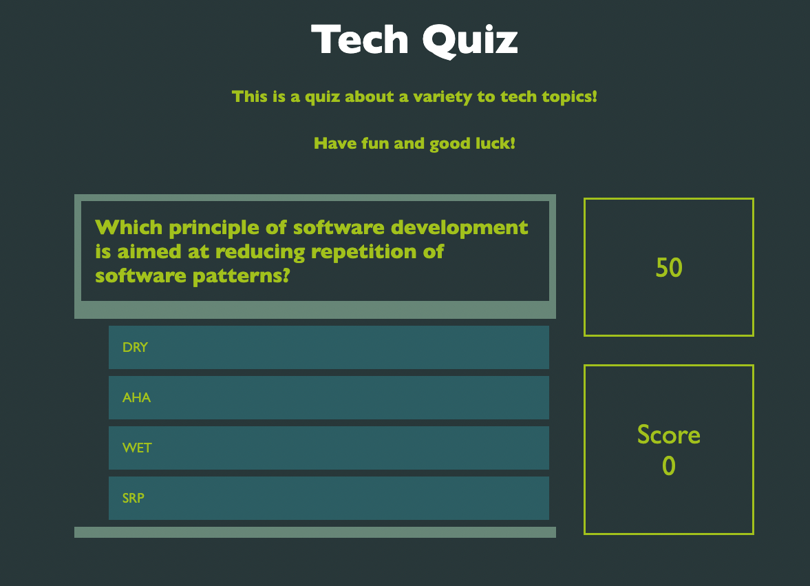

# 04-code-quiz

Link to the deployed application: https://aalink.github.io/04-code-quiz/

An interactive and engaging quiz application requires the three main languages of web development: HTML, CSS, and JavaScript.  In this project, I explore how to combine these three languages in order to create a multiple choice quiz that will keep track of the score and make use of a timer.

  

```
Approach
```
Before writing a single line of code, it was clear that to make this project possible, it would lean heavily on JavaScript.  Despite this fact, a foundation and visual style had to be built, so I began by creating the HTML and CSS for JavaScript to interact with.  After that, I started writing the JavaScript incrementally.  As I added more, I would revisit the HTML to add the appropriate ID attributes that would need to have queries performed on them.


```
Challenges
```
Up until now, my experience with programming has not involved combining code with a graphical user interface. This was one of my biggest challenges.  Learning how to query and modify HTML and CSS with JavaScript can be as empowering as it is difficult when one is introduced to it for the first time. The ability of the player to  save their initials and score required the use of local storage, which is an area that needs to be revisited as I was unable include it in the game.

```
What I Learned
```
Learning how to connect program logic to a user interface has proven to be both challenging and rewarding. After seeing the visual representation of interated elements and modifying their attributes, it opened my eyes to what dynamic HTML really is along with its possibilites.